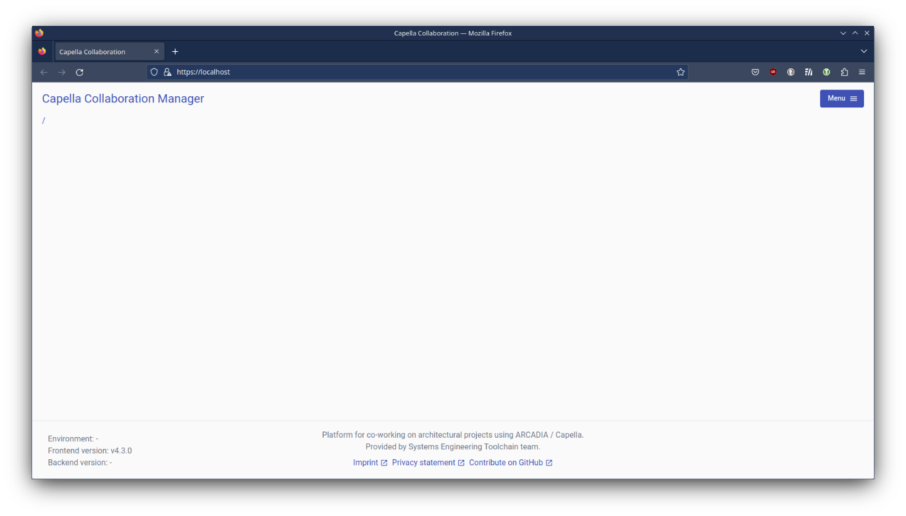

# Commands

## Clone the project
```bash
user@machine:~/capella-collab-manager$ git clone --recurse-submodules https://github.com/DSD-DBS/capella-collab-manager.git
user@machine:~/capella-collab-manager$ cd capella-collab-manager
```

## Create a local k3d cluster and test the registry reachability
```bash
user@machine:~/capella-collab-manager$ make create-cluster reach-registry
type k3d || { echo "K3D is not installed, install k3d and run 'make create-cluster' again"; exit 1; }
k3d registry list myregistry.localhost 2>&- || k3d registry create myregistry.localhost --port 12345
k3d is /usr/local/bin/k3d
INFO[0000] Creating node 'k3d-myregistry.localhost'     
INFO[0000] Successfully created registry 'k3d-myregistry.localhost' 
INFO[0000] Starting node 'k3d-myregistry.localhost'     
INFO[0000] Successfully created registry 'k3d-myregistry.localhost' 
# You can now use the registry like this (example):
# 1. create a new cluster that uses this registry
k3d cluster create --registry-use k3d-myregistry.localhost:12345

# 2. tag an existing local image to be pushed to the registry
docker tag nginx:latest k3d-myregistry.localhost:12345/mynginx:v0.1

# 3. push that image to the registry
docker push k3d-myregistry.localhost:12345/mynginx:v0.1

# 4. run a pod that uses this image
kubectl run mynginx --image k3d-myregistry.localhost:12345/mynginx:v0.1

k3d cluster list collab-cluster 2>&- || k3d cluster create collab-cluster \
        --registry-use k3d-myregistry.localhost:12345 \
        -p "8080:80@loadbalancer" \
        -p "443:443@loadbalancer" \
        -p "30000-30005:30000-30005@server:0"
kubectl cluster-info
kubectl config set-context --current --namespace=collab-manager
kubectl create namespace collab-sessions
INFO[0000] portmapping '443:443' targets the loadbalancer: defaulting to [servers:*:proxy agents:*:proxy] 
INFO[0000] portmapping '8080:80' targets the loadbalancer: defaulting to [servers:*:proxy agents:*:proxy] 
INFO[0000] Prep: Network                                
INFO[0000] Re-using existing network 'k3d-collab-cluster' (243aeccb19364f7545c1a04abbcd0611f9a6c7e081089ad3358ffc2201a5d6f1) 
INFO[0000] Created image volume k3d-collab-cluster-images 
INFO[0000] Starting new tools node...                   
INFO[0000] Starting node 'k3d-collab-cluster-tools'     
INFO[0001] Creating node 'k3d-collab-cluster-server-0'  
INFO[0001] Creating LoadBalancer 'k3d-collab-cluster-serverlb' 
INFO[0001] Using the k3d-tools node to gather environment information 
INFO[0001] Starting new tools node...                   
INFO[0002] Starting node 'k3d-collab-cluster-tools'     
INFO[0003] Starting cluster 'collab-cluster'            
INFO[0003] Starting servers...                          
INFO[0003] Starting node 'k3d-collab-cluster-server-0'  
INFO[0009] All agents already running.                  
INFO[0009] Starting helpers...                          
INFO[0009] Starting node 'k3d-collab-cluster-serverlb'  
INFO[0015] Injecting records for hostAliases (incl. host.k3d.internal) and for 4 network members into CoreDNS configmap... 
INFO[0019] Cluster 'collab-cluster' created successfully! 
INFO[0019] You can now use it like this:                
kubectl cluster-info
Kubernetes control plane is running at https://0.0.0.0:36929
CoreDNS is running at https://0.0.0.0:36929/api/v1/namespaces/kube-system/services/kube-dns:dns/proxy
Metrics-server is running at https://0.0.0.0:36929/api/v1/namespaces/kube-system/services/https:metrics-server:https/proxy

To further debug and diagnose cluster problems, use 'kubectl cluster-info dump'.
Context "k3d-collab-cluster" modified.
namespace/collab-sessions created
```

## Export environment variables
```bash
user@machine:~/capella-collab-manager$ export DOCKER_REGISTRY=ghcr.io/dsd-dbs/capella-collab-manager
user@machine:~/capella-collab-manager$ export CAPELLACOLLAB_SESSIONS_REGISTRY=ghcr.io/dsd-dbs/capella-dockerimages
```

## Fetch management portal and session images from GitHub (without T4C support).
*This option is recommended for the first deployment.*
```bash
user@machine:~/capella-collab-manager$ DEVELOPMENT_MODE=1 make helm-deploy open
Getting updates for unmanaged Helm repositories...
...Successfully got an update from the "https://grafana.github.io/helm-charts/" chart repository
...Successfully got an update from the "https://prometheus-community.github.io/helm-charts" chart repository
Hang tight while we grab the latest from your chart repositories...
...Successfully got an update from the "bitnami" chart repository
Update Complete. ⎈Happy Helming!⎈
Saving 2 charts
Downloading loki from repo https://grafana.github.io/helm-charts/
Downloading kube-state-metrics from repo https://prometheus-community.github.io/helm-charts
Deleting outdated charts
Start helm upgrade...
Successfully packaged chart and saved it to: /tmp/user/1000/tmp.F0GgBEpoDd/collab-manager-v4.10.0-2-gfc151f90.tgz
Release "dev" does not exist. Installing it now.
W1029 11:24:20.519028   12440 warnings.go:70] spec.template.spec.containers[0].resources.limits[memory]: fractional byte value "214748364800m" is invalid, must be an integer
NAME: dev
LAST DEPLOYED: Tue Oct 29 11:24:13 2024
NAMESPACE: collab-manager
STATUS: deployed
REVISION: 1
TEST SUITE: None
NOTES:
█▀▄░█▀▄░░░█░█▀█░█▀▀░█▀▄░█▀█░█▀▀░█▀█░░░█▀█░█▀▀
█░█░█▀▄░░░█░█░█░█▀▀░█▀▄░█▀█░█░█░█░█░░░█▀█░█░█
▀▀░░▀▀░░░░▀░▀░▀░▀░░░▀░▀░▀░▀░▀▀▀░▀▀▀░░░▀░▀░▀▀▀

Thanks for using our tools!
make[1]: Entering directory '/home/user/capella-collab-manager'
echo "Waiting for guacamole container, before we can initialize the database..."
kubectl get --context k3d-collab-cluster -n collab-manager --watch pods &
sleep 2
kubectl wait --for=condition=Ready pods --timeout=10m --context k3d-collab-cluster -n collab-manager -l id=dev-deployment-guacamole-guacamole
kubectl wait --for=condition=Ready pods --timeout=10m --context k3d-collab-cluster -n collab-manager -l id=dev-deployment-guacamole-postgres
kill %%
TABLE_EXISTS=$(kubectl exec --context k3d-collab-cluster -n collab-manager --container dev-guacamole-postgres deployment/dev-guacamole-postgres -- psql -U guacamole -tAc "SELECT EXISTS(SELECT 1 FROM information_schema .tables WHERE table_name='guacamole_user');")
if [[ $TABLE_EXISTS == "t" ]]; then
echo "Guacamole database already initialized. Skipping initialization.";
exit 0;
fi
kubectl exec --context k3d-collab-cluster --namespace collab-manager --container dev-guacamole-guacamole deployment/dev-guacamole-guacamole -- /opt/guacamole/bin/initdb.sh --postgresql | \
kubectl exec -i --context k3d-collab-cluster --namespace collab-manager deployment/dev-guacamole-postgres -- psql -U guacamole guacamole
echo "Guacamole database initialized successfully.";
Waiting for guacamole container, before we can initialize the database...
NAME                                       READY   STATUS              RESTARTS   AGE
dev-backend-79bdf87454-9zhms               0/2     ContainerCreating   0          75s
dev-backend-postgres-67ffdd7dd8-w8ctb      0/1     Running             0          76s
dev-docs-648448ff47-sdnjj                  1/1     Running             0          76s
dev-frontend-58cb979b9f-dcjh8              2/2     Running             0          75s
dev-grafana-nginx-6b768c5d77-pcpsw         1/1     Running             0          75s
dev-grafana-server-79b7787878-hvdnp        0/1     ContainerCreating   0          75s
dev-guacamole-guacamole-57d7486455-btkbx   0/2     ContainerCreating   0          74s
dev-guacamole-guacd-749bf84c96-6pfc4       2/2     Running             0          76s
dev-guacamole-postgres-5c975fc854-8nxjx    0/1     Running             0          76s
dev-kube-state-metrics-5f78d8887d-wjkzm    1/1     Running             0          75s
dev-minio-0                                1/1     Running             0          75s
dev-oauth-mock-54f94b6446-9wr92            1/1     Running             0          76s
dev-prometheus-nginx-7798d45dbf-sxntp      1/1     Running             0          76s
dev-prometheus-server-6b4b589d7c-mtwpj     1/1     Running             0          74s
dev-session-nginx-65fc578b9-8f6lg          1/1     Running             0          76s
dev-session-nginx-65fc578b9-knh92          1/1     Running             0          76s
dev-smtp-mock-5fdc6bbc79-r8kq2             1/1     Running             0          76s
dev-valkey-75cf865b85-nk5pd                1/1     Running             0          76s
loki-backend-0                             0/1     Running             0          76s
loki-backend-1                             1/1     Running             0          74s
loki-gateway-6f7464859c-cfv4x              1/1     Running             0          74s
loki-read-6587d775c6-6gklz                 1/1     Running             0          75s
loki-read-6587d775c6-xfhnf                 1/1     Running             0          75s
loki-write-0                               1/1     Running             0          75s
loki-write-1                               0/1     Running             0          75s
loki-backend-0                             1/1     Running             0          76s
loki-write-1                               1/1     Running             0          80s
dev-grafana-server-79b7787878-hvdnp        1/1     Running             0          82s
dev-guacamole-postgres-5c975fc854-8nxjx    1/1     Running             0          91s
dev-backend-postgres-67ffdd7dd8-w8ctb      1/1     Running             0          91s
dev-guacamole-guacamole-57d7486455-btkbx   1/2     Running             0          92s
dev-guacamole-guacamole-57d7486455-btkbxpod/dev-guacamole-guacamole-57d7486455-btkbx condition met
   2/2     Running             0          92s
pod/dev-guacamole-postgres-5c975fc854-8nxjx condition met
CREATE TYPE
CREATE TYPE
CREATE TYPE
CREATE TYPE
CREATE TYPE
CREATE TABLE
CREATE INDEX
CREATE TABLE
CREATE INDEX
CREATE TABLE
CREATE TABLE
CREATE TABLE
CREATE TABLE
CREATE TABLE
CREATE INDEX
CREATE TABLE
CREATE INDEX
CREATE TABLE
CREATE INDEX
CREATE TABLE
CREATE INDEX
CREATE TABLE
CREATE INDEX
CREATE TABLE
CREATE INDEX
CREATE TABLE
CREATE INDEX
CREATE TABLE
CREATE INDEX
CREATE TABLE
CREATE INDEX
CREATE INDEX
CREATE TABLE
CREATE INDEX
CREATE INDEX
CREATE TABLE
CREATE INDEX
CREATE INDEX
CREATE TABLE
CREATE INDEX
CREATE TABLE
CREATE INDEX
CREATE INDEX
CREATE TABLE
CREATE INDEX
CREATE INDEX
CREATE TABLE
CREATE INDEX
CREATE INDEX
CREATE INDEX
CREATE INDEX
CREATE INDEX
CREATE INDEX
CREATE TABLE
CREATE INDEX
CREATE INDEX
CREATE INDEX
CREATE INDEX
CREATE TABLE
CREATE INDEX
INSERT 0 1
INSERT 0 1
INSERT 0 6
INSERT 0 3
Guacamole database initialized successfully.
-----------------------------------------------------------
--- Please wait until all services are in running state ---
-----------------------------------------------------------
NAME                                       READY   STATUS              RESTARTS   AGE
dev-backend-79bdf87454-9zhms               0/2     ContainerCreating   0          98s
dev-backend-postgres-67ffdd7dd8-w8ctb      1/1     Running             0          99s
dev-docs-648448ff47-sdnjj                  1/1     Running             0          99s
dev-frontend-58cb979b9f-dcjh8              2/2     Running             0          98s
dev-grafana-nginx-6b768c5d77-pcpsw         1/1     Running             0          98s
dev-grafana-server-79b7787878-hvdnp        1/1     Running             0          98s
dev-guacamole-guacamole-57d7486455-btkbx   2/2     Running             0          97s
dev-guacamole-guacd-749bf84c96-6pfc4       2/2     Running             0          99s
dev-guacamole-postgres-5c975fc854-8nxjx    1/1     Running             0          99s
dev-kube-state-metrics-5f78d8887d-wjkzm    1/1     Running             0          98s
dev-minio-0                                1/1     Running             0          98s
dev-oauth-mock-54f94b6446-9wr92            1/1     Running             0          99s
dev-prometheus-nginx-7798d45dbf-sxntp      1/1     Running             0          99s
dev-prometheus-server-6b4b589d7c-mtwpj     1/1     Running             0          97s
dev-session-nginx-65fc578b9-8f6lg          1/1     Running             0          99s
dev-session-nginx-65fc578b9-knh92          1/1     Running             0          99s
dev-smtp-mock-5fdc6bbc79-r8kq2             1/1     Running             0          99s
dev-valkey-75cf865b85-nk5pd                1/1     Running             0          99s
loki-backend-0                             1/1     Running             0          99s
loki-backend-1                             1/1     Running             0          97s
loki-gateway-6f7464859c-cfv4x              1/1     Running             0          97s
loki-read-6587d775c6-6gklz                 1/1     Running             0          98s
loki-read-6587d775c6-xfhnf                 1/1     Running             0          98s
loki-write-0                               1/1     Running             0          98s
loki-write-1                               1/1     Running             0          98s
dev-smtp-mock-5fdc6bbc79-r8kq2             0/1     Completed           0          99s
dev-smtp-mock-5fdc6bbc79-r8kq2             1/1     Running             1 (3s ago)   101s
dev-backend-79bdf87454-9zhms               1/2     Running             0            101s
dev-backend-79bdf87454-9zhms               2/2     Running             0            2m52s
deployment.apps/dev-backend condition met
deployment.apps/dev-backend-postgres condition met
deployment.apps/dev-docs condition met
deployment.apps/dev-frontend condition met
deployment.apps/dev-grafana-nginx condition met
deployment.apps/dev-grafana-server condition met
deployment.apps/dev-guacamole-guacamole condition met
deployment.apps/dev-guacamole-guacd condition met
deployment.apps/dev-guacamole-postgres condition met
deployment.apps/dev-kube-state-metrics condition met
deployment.apps/dev-oauth-mock condition met
deployment.apps/dev-prometheus-nginx condition met
deployment.apps/dev-prometheus-server condition met
deployment.apps/dev-session-nginx condition met
deployment.apps/dev-smtp-mock condition met
deployment.apps/dev-valkey condition met
deployment.apps/loki-gateway condition met
deployment.apps/loki-read condition met
make[1]: Leaving directory '/home/user/capella-collab-manager'
QSocketNotifier: Can only be used with threads started with QThread
QSocketNotifier: Can only be used with threads started with QThread

```
## Screenshot of localhost missing backend


```bash
user@machine:~/capella-collab-manager$ kubectl get pods
NAME                                       READY   STATUS    RESTARTS       AGE
dev-backend-79bdf87454-9zhms               1/2     Running   4 (6s ago)     7m38s
dev-backend-postgres-67ffdd7dd8-w8ctb      1/1     Running   0              7m39s
dev-docs-648448ff47-sdnjj                  1/1     Running   0              7m39s
dev-frontend-58cb979b9f-dcjh8              2/2     Running   0              7m38s
dev-grafana-nginx-6b768c5d77-pcpsw         1/1     Running   0              7m38s
dev-grafana-server-79b7787878-hvdnp        1/1     Running   0              7m38s
dev-guacamole-guacamole-57d7486455-btkbx   2/2     Running   0              7m37s
dev-guacamole-guacd-749bf84c96-6pfc4       2/2     Running   0              7m39s
dev-guacamole-postgres-5c975fc854-8nxjx    0/1     Running   2 (6s ago)     7m39s
dev-kube-state-metrics-5f78d8887d-wjkzm    1/1     Running   0              7m38s
dev-minio-0                                1/1     Running   0              7m38s
dev-oauth-mock-54f94b6446-9wr92            1/1     Running   0              7m39s
dev-prometheus-nginx-7798d45dbf-sxntp      1/1     Running   0              7m39s
dev-prometheus-server-6b4b589d7c-mtwpj     1/1     Running   0              7m37s
dev-session-nginx-65fc578b9-8f6lg          1/1     Running   0              7m39s
dev-session-nginx-65fc578b9-knh92          1/1     Running   0              7m39s
dev-smtp-mock-5fdc6bbc79-r8kq2             1/1     Running   1 (6m1s ago)   7m39s
dev-valkey-75cf865b85-nk5pd                1/1     Running   0              7m39s
loki-backend-0                             1/1     Running   0              7m39s
loki-backend-1                             1/1     Running   0              7m37s
loki-gateway-6f7464859c-cfv4x              1/1     Running   0              7m37s
loki-read-6587d775c6-6gklz                 1/1     Running   0              7m38s
loki-read-6587d775c6-xfhnf                 1/1     Running   0              7m38s
loki-write-0                               1/1     Running   0              7m38s
loki-write-1                               1/1     Running   0              7m38s
```

```bash
user@machine:~/capella-collab-manager$ kubectl get pods
NAME                                       READY   STATUS    RESTARTS        AGE
dev-backend-79bdf87454-9zhms               1/2     Running   7 (2m58s ago)   15m
dev-backend-postgres-67ffdd7dd8-w8ctb      1/1     Running   0               15m
dev-docs-648448ff47-sdnjj                  1/1     Running   0               15m
dev-frontend-58cb979b9f-dcjh8              2/2     Running   0               15m
dev-grafana-nginx-6b768c5d77-pcpsw         1/1     Running   0               15m
dev-grafana-server-79b7787878-hvdnp        1/1     Running   0               15m
dev-guacamole-guacamole-57d7486455-btkbx   2/2     Running   0               14m
dev-guacamole-guacd-749bf84c96-6pfc4       2/2     Running   0               15m
dev-guacamole-postgres-5c975fc854-8nxjx    1/1     Running   5 (77s ago)     15m
dev-kube-state-metrics-5f78d8887d-wjkzm    1/1     Running   0               15m
dev-minio-0                                1/1     Running   0               15m
dev-oauth-mock-54f94b6446-9wr92            1/1     Running   0               15m
dev-prometheus-nginx-7798d45dbf-sxntp      1/1     Running   0               15m
dev-prometheus-server-6b4b589d7c-mtwpj     1/1     Running   0               14m
dev-session-nginx-65fc578b9-8f6lg          1/1     Running   0               15m
dev-session-nginx-65fc578b9-knh92          1/1     Running   0               15m
dev-smtp-mock-5fdc6bbc79-r8kq2             1/1     Running   1 (13m ago)     15m
dev-valkey-75cf865b85-nk5pd                1/1     Running   0               15m
loki-backend-0                             1/1     Running   0               15m
loki-backend-1                             1/1     Running   0               14m
loki-gateway-6f7464859c-cfv4x              1/1     Running   0               14m
loki-read-6587d775c6-6gklz                 1/1     Running   0               15m
loki-read-6587d775c6-xfhnf                 1/1     Running   0               15m
loki-write-0                               1/1     Running   0               15m
loki-write-1                               1/1     Running   0               15m
```

```bash
user@machine:~/capella-collab-manager$ kubectl logs dev-backend-79bdf87454-x85fc
Defaulted container "dev-backend" out of: dev-backend, promtail
```