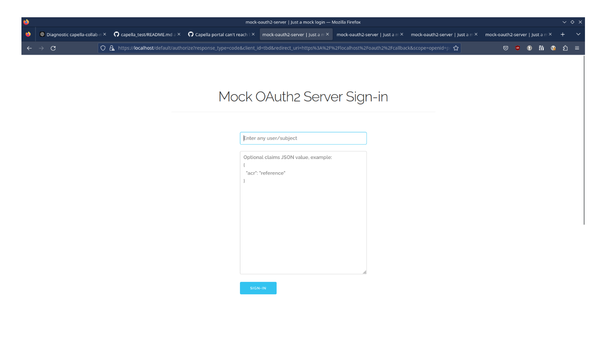
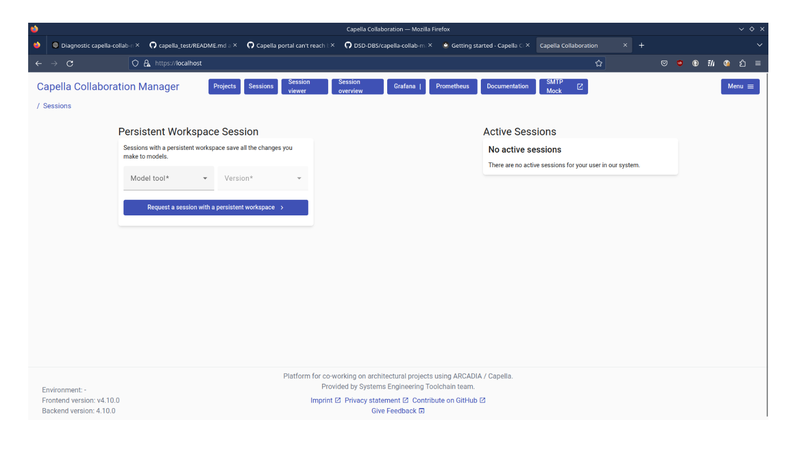
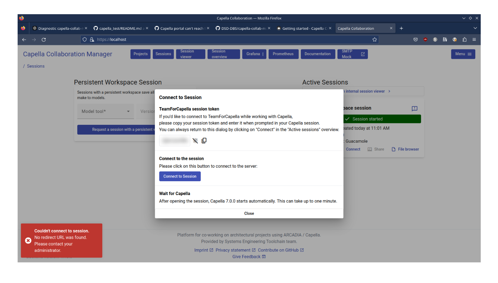
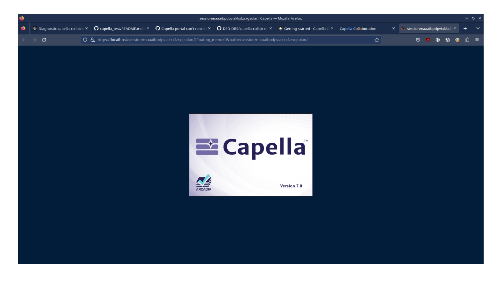
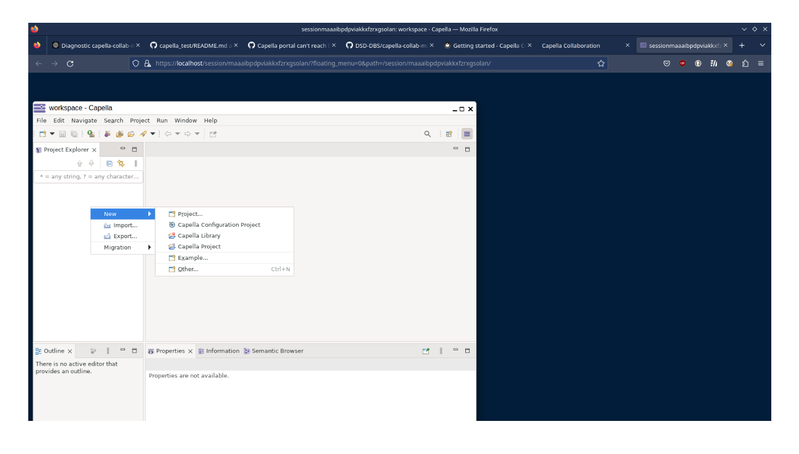
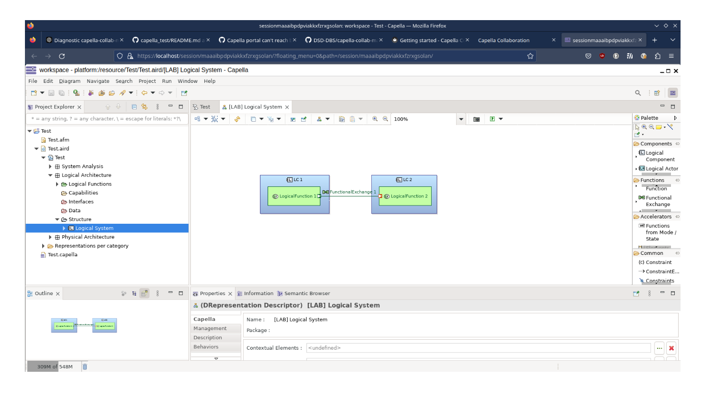

The following process has been executed 4 times.
*(Run the platform. Fail. Delete whole platform)*
```bash
make create-cluster reach-registry
DEVELOPMENT_MODE=1 make helm-deploy open
make delete-cluster
k3d registry delete k3d-myregistry.localhost
```
Then, at the 5th times, it worked !
```bash
user@machine:~/capella-collab-manager$ kubectl get pods
NAME                                       READY   STATUS    RESTARTS      AGE
dev-backend-649d7964c9-fqp26               2/2     Running   0             3m15s
dev-backend-postgres-67ffdd7dd8-wh2n4      1/1     Running   0             3m14s
dev-docs-648448ff47-2qn55                  1/1     Running   0             3m15s
dev-frontend-58cb979b9f-cp2h8              2/2     Running   0             3m14s
dev-grafana-nginx-6b768c5d77-tmzj6         1/1     Running   0             3m15s
dev-grafana-server-79b7787878-fg74s        1/1     Running   0             3m15s
dev-guacamole-guacamole-57d7486455-6s7nv   2/2     Running   0             3m14s
dev-guacamole-guacd-749bf84c96-wnkv9       2/2     Running   0             3m13s
dev-guacamole-postgres-5c975fc854-vvtxd    1/1     Running   1 (60s ago)   3m14s
dev-kube-state-metrics-5f78d8887d-kl95w    1/1     Running   0             3m15s
dev-minio-0                                1/1     Running   0             3m14s
dev-oauth-mock-54f94b6446-lb6gz            1/1     Running   0             3m14s
dev-prometheus-nginx-7798d45dbf-ctf9b      1/1     Running   0             3m13s
dev-prometheus-server-6b4b589d7c-8qx6w     1/1     Running   0             3m13s
dev-session-nginx-65fc578b9-2grz8          1/1     Running   0             3m14s
dev-session-nginx-65fc578b9-plskm          1/1     Running   0             3m15s
dev-smtp-mock-5fdc6bbc79-ssb47             1/1     Running   0             3m14s
dev-valkey-75cf865b85-bx2dd                1/1     Running   0             3m15s
loki-backend-0                             1/1     Running   0             3m14s
loki-backend-1                             1/1     Running   0             3m13s
loki-gateway-6f7464859c-2z6hx              1/1     Running   0             3m13s
loki-read-6587d775c6-nrw89                 1/1     Running   0             3m13s
loki-read-6587d775c6-tchkp                 1/1     Running   0             3m13s
loki-write-0                               1/1     Running   0             3m14s
loki-write-1                               1/1     Running   0             3m14s
```
But know, the `https://localhost` instant redirect to the route `https://localhost/default/authorize?response_type=code&client_id=tbd&redirect_uri=https%3A%2F%2Flocalhost%2Foauth2%2Fcallback&scope=openid+profile+offline_access&state=BKJfxLw0ZJyn1iXIIDjTaVfMYnMrVM&code_challenge=FxNpvbABBrn20Ry_vfzitQyhAIHCw4PmVyuyfvNBcr8&code_challenge_method=S256&nonce=111863271847458434611730367932`
The redirected page is the following :


After submitting `admin` as username, the following page is displayed : 


Following actions have been done :
* Request a session with a persistant workspace (`Capella`, `7.0.0`, `Guacamole`)
* Wait for workspace creation
* Click on "connect" to the active session
* Click on "Connect to session"
But it doesn't worked, and it displayed the error message `"No redirect URL was found"`.


New attempt, with other one configuration :
* Request a session with a persistant workspace (`Capella`, `7.0.0`, `Xpra`)
* Wait for workspace creation
* Click on "connect" to the active session
* Click on "Connect to session"
Then, it redirect to the route `https://localhost/session/maaaibpdpviakkxfzrxgsolan/?floating_menu=0&path=/session/maaaibpdpviakkxfzrxgsolan/`


When Capella is loaded, it's possible to create a new Capelal project.


